# Maestrina

**Health check pós-go-live de clusters MongoDB Atlas para calibração de 30, 60 e 90 dias.**

---

## 1. O que é

Quando um novo workload entra em produção no Atlas, o plano de projeto prevê
uma **fase de calibração**: em datas combinadas (tipicamente 30, 60 e 90 dias
após o go-live), o consumo real é comparado com a faixa que foi prevista no
dimensionamento. A Maestrina é a ferramenta que faz essa medição.

Ela produz **um arquivo JSON por checkpoint**, contendo apenas estatísticas
operacionais do cluster: taxas de operações, tamanhos de dados e índices,
saúde da replicação, eficiência de consultas, custos por categoria e cobertura
de alertas. Esse arquivo é aberto num dashboard local e vira a base da reunião
de checkpoint: **previsto vs. medido, na tela, com o cliente**.

**Quem executa a coleta é o próprio cliente**, com credenciais próprias que
nunca saem da organização dele — a MongoDB recebe apenas o arquivo de
estatísticas gerado.

**O que a Maestrina não é:** ela não é ferramenta de migração nem de
levantamento pré-projeto (isso é papel de outras ferramentas da MongoDB, como
o `mdiag`). Ela só olha para clusters que **já estão em produção no Atlas**.

---

## 2. Garantias de segurança

Este repositório existe para ser inspecionado. Antes de qualquer execução,
recomendamos que o time de segurança leia esta seção e os próprios arquivos.

1. **Nenhuma credencial é compartilhada com a MongoDB — nunca.** A chave de
   API é criada por vocês, guardada no cofre de vocês e usada por um operador
   de vocês, na máquina de vocês. O que sai da organização é apenas o arquivo
   de estatísticas, depois de conferido por vocês.

2. **Só metadados e estatísticas.** Nenhum dado de negócio, nenhum conteúdo de
   documento, nenhum valor de consulta, nenhuma credencial, nenhum dado
   pessoal. O próprio arquivo gerado carrega um **manifesto de compliance**
   listando o que foi coletado e o que é excluído por construção — a prova
   viaja dentro do resultado.

3. **Credenciais nunca ficam em arquivo.** A chave entra por variável de
   ambiente na hora da execução (ou por prompt oculto) e nunca é gravada em
   lugar nenhum pelo script. O script nunca é editado para receber
   credenciais.

4. **O script executado é o script publicado.** Como nenhuma configuração
   exige editar o arquivo, o que roda no seu ambiente é idêntico ao que está
   aqui. Baixe sempre deste repositório e, se quiser, confira o histórico de
   commits — ele é o registro público de cada mudança.

5. **Somente leitura.** O coletor só executa operações de leitura (HTTP GET) —
   isso é verificável no código, que concentra todas as chamadas de rede num
   único ponto.

6. **Mascaramento opcional de nomes.** Se preferirem, nomes de bases, coleções,
   índices e servidores podem ser substituídos por pseudônimos
   (`MAESTRINA_PSEUDO=1`). O mapa que liga pseudônimo ao nome real fica num
   arquivo separado, **com vocês** — ele nunca deve ser enviado.

7. **O nome do cluster é sempre real, de propósito.** Em ambientes com vários
   clusters, ele é a chave para apontar cada achado ao cluster certo. Todos os
   demais nomes são mascaráveis.

8. **Falha não vaza nada.** Se algo der errado, o coletor gera um relatório de
   diagnóstico com mensagens já filtradas: connection strings e chaves nunca
   aparecem. E a chave pode ser **revogada a qualquer momento** por vocês, no
   console do Atlas — sem depender de ninguém.

---

## 3. Como funciona

Legenda de cores: 🟣 **roxo = SA (MongoDB)** · 🟢 **verde = cliente** ·
🟠 **âmbar = segurança do cliente** · ⚪ **cinza = todos juntos**

```mermaid
flowchart TD
    P1["1. Antes de tudo: segurança do cliente inspeciona.<br/>Lê: atlas_healthcheck.py (o script, só leituras)<br/>+ schema (o contrato do resultado) + este README.<br/>Nada roda antes dessa revisão, se vocês quiserem fazê-la."]
    P2["2. Na assinatura do contrato (uma única vez).<br/>Cliente cria uma chave de API só-leitura no próprio console<br/>do Atlas, para USO INTERNO — a chave nunca é compartilhada<br/>com ninguém, nem com a MongoDB — e designa quem do time<br/>vai operar os checkpoints."]
    P3["3. Convite para o checkpoint (30/60/90 dias).<br/>O SA confirma a data combinada no plano de calibração<br/>e envia ao operador: o lembrete das instruções (seção 5)<br/>+ baseline.json (a previsão de consumo feita antes do go-live,<br/>já apresentada no relatório de dimensionamento)."]
    P4["4. Operador do cliente executa a coleta (~15 minutos).<br/>Roda o script público com a chave interna — a chave entra<br/>na hora e não fica em arquivo. Gera: maestrina_output.json<br/>(estatísticas, custos e alertas) + maestrina_debug.json<br/>(diário técnico, sem nenhum dado)."]
    P5["5. Cliente revisa e envia só os resultados.<br/>Os arquivos são texto legível; o manifesto de compliance vai<br/>dentro do próprio output. Envia ao SA: output + debug.<br/>Fica no cliente: a chave, sempre — e o mapa de nomes,<br/>se usou mascaramento."]
    P6["6. Análise no dashboard (100% local).<br/>O SA abre os arquivos no próprio navegador —<br/>nada é enviado a servidor algum. Usa: output + baseline.json."]
    P7["7. Reunião de checkpoint.<br/>Previsto vs. medido na tela, junto com o cliente;<br/>ações são combinadas. O SA registra os combinados<br/>em um arquivo interno de acordos."]

    P1 --> P2 --> P3 --> P4 --> P5 --> P6 --> P7

    classDef sa fill:#E6D5F7,stroke:#7B2FBE,color:#2D0A4E
    classDef cliente fill:#D6F5D6,stroke:#2E8B2E,color:#0B3D0B
    classDef seguranca fill:#FFE8C2,stroke:#CC8400,color:#4D3200
    classDef todos fill:#E8E8E8,stroke:#666666,color:#222222

    class P3,P6 sa
    class P2,P4,P5 cliente
    class P1 seguranca
    class P7 todos
```



---

## 4. Como criar a chave de API (para uso interno do cliente, somente)

Feito **uma única vez**, no console do Atlas, tipicamente na assinatura do
contrato:

1. **Organization → Access Manager → API Keys → Create API Key.**
2. **Permissão: `Org Read Only`.** Por que no nível de organização, e não só
   do projeto? Porque a fatura é um recurso da **organização** no Atlas — uma
   chave restrita ao projeto lê as estatísticas técnicas, mas não os custos, e
   os painéis financeiros sairiam como "indisponíveis".
   (Alternativa equivalente: `Billing Viewer` + `Project Read Only`.)
3. **Restrinja por IP:** na *API Access List* da chave, cadastre apenas o
   endereço IP da máquina do operador que vai executar as coletas. A chave
   não funciona de nenhum outro lugar.
4. **Guarde no cofre de senhas de vocês.** A chave é de uso interno: **não é
   entregue a ninguém — nem à MongoDB.** Nunca a grave em arquivo, ticket,
   chat ou repositório.
5. **Revogação:** a qualquer momento, na mesma tela, sem depender de ninguém.

A chave é usada exclusivamente pelo `atlas_healthcheck.py` — script público
neste repositório, que só executa leituras.

---

## 5. Como executar a coleta (operador do cliente, ~15 minutos)

```bash
# 1. Baixe atlas_healthcheck.py deste repositório (sempre da fonte pública)

# 2. Exporte as variáveis na hora, a partir do cofre —
#    nunca as persista em .zshrc/.env:
export MAESTRINA_ATLAS_PUBLIC_KEY='<do cofre>'
export MAESTRINA_ATLAS_PRIVATE_KEY='<do cofre>'
export MAESTRINA_ATLAS_PROJECT='<projectId>'
export MAESTRINA_ATLAS_CLUSTER='<nome do cluster>'  # opcional se o projeto só tem 1

# 3. (Recomendado durante o piloto) ligue o diário técnico:
export MAESTRINA_DEBUG=1

# 4. Aponte para o baseline enviado pelo SA (a previsão de consumo):
export MAESTRINA_BASELINE_FILE='baseline.json'

# 5. (Opcional) mascaramento de nomes:
# export MAESTRINA_PSEUDO=1

# 6. Execute (Python 3, sem nenhuma dependência para instalar):
python3 atlas_healthcheck.py

# 7. Limpe as chaves da sessão:
unset MAESTRINA_ATLAS_PUBLIC_KEY MAESTRINA_ATLAS_PRIVATE_KEY
```

Dica: se preferir não usar variáveis para a chave, basta rodar o script —
ele pede as chaves na hora, com digitação oculta, e não as grava em lugar
nenhum.

- **Arquivos gerados:** `maestrina_output_...json` (o resultado) e
  `maestrina_debug_...json` (diário de execução, sem nenhum dado coletado).
  **Inspecione ambos antes de enviar ao SA.**
- **O que NUNCA é enviado:** a chave de API (fica no cofre de vocês) e, se
  usou mascaramento, o arquivo `*.pseudonym_map.json` (o mapa de nomes é de
  vocês).
- Se algo falhar, o script gera um relatório de diagnóstico com credenciais
  já filtradas — envie-o junto para acelerar a correção.

---

## 6. Arquivos deste repositório

| Arquivo | O que é |
|---|---|
| `atlas_healthcheck.py` | O coletor do fluxo: o operador do cliente roda com a chave interna, via API do Atlas |
| `schema/maestrina_output.schema.json` | O contrato do resultado: define, campo a campo, tudo que um arquivo da Maestrina pode conter. É a versão executável do manifesto de compliance |
| `maestrina_collect.js` | Coletor de contingência (via mongosh), fora do fluxo padrão — mantido público para auditoria; sem visão de custos e alertas |
| `README.md` | Este documento |

### Crédito

A abordagem de coleta **apenas de metadados** em clusters fragmentados
(sharded), via mongos, é creditada ao
[msizer, de Felipe Scabral](https://github.com/felipesscabral/msizer-mongodb) —
código reimplementado, com crédito no cabeçalho dos coletores e no próprio
schema.

<!-- END OF FILE — README.md v2 -->
