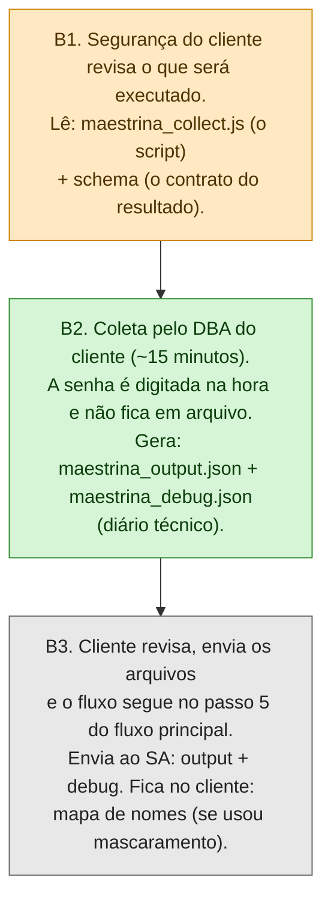

# Maestrina

**Health check pós-go-live de clusters MongoDB Atlas — para checkpoints de calibração de 30, 60 e 90 dias.**

---

## 1. O que é

Quando um novo workload entra em produção no Atlas, o plano de projeto prevê
uma **fase de calibração**: em datas combinadas (tipicamente 30, 60 e 90 dias
após o go-live), o consumo real é comparado com a faixa que foi prevista no
dimensionamento. A Maestrina é a ferramenta que faz essa medição.

Ela produz **um arquivo JSON por checkpoint**, contendo apenas estatísticas
operacionais do cluster: taxas de operações, tamanhos de dados e índices,
saúde da replicação, eficiência de consultas, custos por categoria e cobertura
de alertas. Esse arquivo é aberto num dashboard local e vira a base da reunião
de checkpoint: **previsto vs. medido, na tela, com o cliente**.

**O que a Maestrina não é:** ela não é ferramenta de migração nem de
levantamento pré-projeto (isso é papel de outras ferramentas da MongoDB, como
o `mdiag`). Ela só olha para clusters que **já estão em produção no Atlas**.

---

## 2. Garantias de segurança

Este repositório existe para ser inspecionado. Antes de qualquer execução,
recomendamos que o time de segurança leia esta seção e os próprios arquivos.

1. **Só metadados e estatísticas.** Nenhum dado de negócio, nenhum conteúdo de
   documento, nenhum valor de consulta, nenhuma credencial, nenhum dado
   pessoal. O próprio arquivo gerado carrega um **manifesto de compliance**
   listando o que foi coletado e o que é excluído por construção — a prova
   viaja dentro do resultado.

2. **Credenciais nunca ficam em arquivo.** Senhas e chaves são digitadas na
   hora ou passadas por variável de ambiente. Os scripts nunca são editados
   para receber credenciais.

3. **O script executado é o script publicado.** Como nenhuma configuração
   exige editar o arquivo, o que roda no seu ambiente é idêntico ao que está
   aqui. Baixe sempre deste repositório e, se quiser, confira o histórico de
   commits — ele é o registro público de cada mudança.

4. **Somente leitura.** O coletor via API só executa operações de leitura
   (HTTP GET) — isso é verificável no código, que concentra todas as chamadas
   de rede num único ponto. O coletor via mongosh usa apenas comandos de
   consulta de estatísticas.

5. **Mascaramento opcional de nomes.** Se preferirem, nomes de bases, coleções,
   índices e servidores podem ser substituídos por pseudônimos
   (`MAESTRINA_PSEUDO=1`). O mapa que liga pseudônimo ao nome real fica num
   arquivo separado, **com quem rodou a coleta** — ele nunca deve ser enviado.

6. **O nome do cluster é sempre real, de propósito.** Em ambientes com vários
   clusters, ele é a chave para apontar cada achado ao cluster certo. Todos os
   demais nomes são mascaráveis.

7. **Falha não vaza nada.** Se algo der errado, o coletor gera um relatório de
   diagnóstico com mensagens já filtradas: connection strings e chaves nunca
   aparecem. E a chave de API pode ser **revogada a qualquer momento** no
   console do Atlas.

---

## 3. Os dois modos de coleta

| | Modo recomendado: **via API** | Plano B: **via mongosh** |
|---|---|---|
| Quem executa | O arquiteto da MongoDB (SA) | O DBA do cliente (~15 min) |
| O que o cliente faz | Cria uma chave só-leitura **uma única vez**, na assinatura | Roda um script e envia dois arquivos |
| O que sai no resultado | Visão completa: técnica + **custos** + alertas | Visão técnica; custos e alertas saem marcados como "indisponíveis" |
| Script | `atlas_healthcheck.py` | `maestrina_collect.js` |

O modo via API é o recomendado porque a comparação central do checkpoint é
**custo realizado vs. custo previsto** — e porque, depois de criar a chave, o
esforço recorrente do cliente é zero. O modo mongosh existe como garantia:
**o checkpoint nunca é adiado por falta de chave.**

---

## 4. Fluxo principal (coleta via API)

Legenda de cores: 🟣 **roxo = SA (MongoDB)** · 🟢 **verde = cliente** ·
🟠 **âmbar = segurança do cliente** · ⚪ **cinza = todos juntos**

```mermaid
flowchart TD
    P1["1. Na assinatura do contrato (uma única vez).<br/>Cliente cria uma chave de acesso só-leitura no console do Atlas.<br/>Entrega ao SA: a chave (canal seguro) —<br/>restrita por IP, revogável a qualquer momento."]
    P2["2. Convite para o checkpoint (30/60/90 dias).<br/>O SA confirma a data combinada no plano de calibração;<br/>o cliente não precisa agir. Trafega: só o e-mail de agenda."]
    P3["3. SA executa a coleta pela API.<br/>Script público e inspecionável (atlas_healthcheck.py) —<br/>só operações de leitura. Gera: maestrina_output.json<br/>com estatísticas, custos e alertas."]
    P4["4. Transparência: cliente pode inspecionar.<br/>O arquivo é texto legível; o SA compartilha antes da reunião<br/>para conferência. Contém: só metadados e estatísticas —<br/>o manifesto de compliance vai dentro do arquivo."]
    P5["5. Análise no dashboard (100% local).<br/>O SA abre os arquivos no próprio navegador —<br/>nada é enviado a servidor algum. Usa: output + baseline.json<br/>(a previsão de consumo feita antes do go-live)."]
    P6["6. Reunião de checkpoint.<br/>Previsto vs. medido na tela, junto com o cliente;<br/>ações são combinadas. O SA registra os combinados<br/>em um arquivo interno de acordos."]

    P1 --> P2 --> P3 --> P4 --> P5 --> P6

    classDef sa fill:#E6D5F7,stroke:#7B2FBE,color:#2D0A4E
    classDef cliente fill:#D6F5D6,stroke:#2E8B2E,color:#0B3D0B
    classDef seguranca fill:#FFE8C2,stroke:#CC8400,color:#4D3200
    classDef todos fill:#E8E8E8,stroke:#666666,color:#222222

    class P2,P3,P5 sa
    class P1 cliente
    class P4 seguranca
    class P6 todos
```



---

## 5. Plano B (coleta via mongosh, pelo DBA do cliente)

> **O checkpoint nunca é adiado por falta de chave.** Sem ela, a coleta é
> feita pelo DBA do cliente — mesmo arquivo, mesmo formato; apenas os painéis
> de custos e alertas saem como "indisponíveis" até a chave existir.



### Como o DBA executa

```bash
# 1. Baixe maestrina_collect.js deste repositório (sempre da fonte pública)

# 2. (Recomendado durante o piloto) ligue o diário técnico:
export MAESTRINA_DEBUG=1

# 3. (Opcional) mascaramento de nomes:
# export MAESTRINA_PSEUDO=1

# 4. Execute — a senha é pedida na hora:
mongosh "mongodb+srv://SEU-CLUSTER/" --username SEU_USUARIO \
        --file maestrina_collect.js
```

- **Privilégios necessários:** `clusterMonitor` + `readAnyDatabase` (papéis
  padrão de monitoramento — sem acesso de escrita).
- **Arquivos gerados:** `maestrina_output_...json` (o resultado) e
  `maestrina_debug_...json` (diário de execução, sem nenhum dado coletado).
  Inspecione ambos antes de enviar. Se usou mascaramento, o terceiro arquivo
  (`*.pseudonym_map.json`) **fica com vocês** e não é enviado.
- Em clusters fragmentados (sharded), conecte pelo **mongos**.

---

## 6. Como criar a chave de API só-leitura (modo recomendado)

Feito **uma única vez**, no console do Atlas, tipicamente na assinatura do
contrato:

1. **Organization → Access Manager → API Keys → Create API Key.**
2. **Permissão: `Org Read Only`.** Por que no nível de organização, e não só
   do projeto? Porque a fatura é um recurso da **organização** no Atlas — uma
   chave restrita ao projeto lê as estatísticas técnicas, mas não os custos, e
   os painéis financeiros sairiam como "indisponíveis".
   (Alternativa equivalente: `Billing Viewer` + `Project Read Only`.)
3. **Restrinja por IP:** na *API Access List* da chave, cadastre apenas o
   endereço IP informado pelo SA. A chave não funciona de nenhum outro lugar.
4. **Entregue por canal seguro** (cofre de senhas, link expirável — nunca
   e-mail aberto).
5. **Revogação:** a qualquer momento, na mesma tela, sem depender de ninguém.

A chave é usada exclusivamente pelo `atlas_healthcheck.py` — script público
neste repositório, que só executa leituras.

---

## 7. Arquivos deste repositório

| Arquivo | O que é |
|---|---|
| `maestrina_collect.js` | Coletor do plano B — o DBA roda via mongosh |
| `atlas_healthcheck.py` | Coletor do modo recomendado — o SA roda via API do Atlas, com a chave só-leitura |
| `schema/maestrina_output.schema.json` | O contrato do resultado: define, campo a campo, tudo que um arquivo da Maestrina pode conter. É a versão executável do manifesto de compliance |
| `README.md` | Este documento |

### Crédito

A abordagem de coleta **apenas de metadados** em clusters fragmentados
(sharded), via mongos, é creditada ao
[msizer, de Felipe Scabral](https://github.com/felipesscabral/msizer-mongodb) —
código reimplementado, com crédito no cabeçalho dos coletores e no próprio
schema.

<!-- END OF FILE — README.md -->
